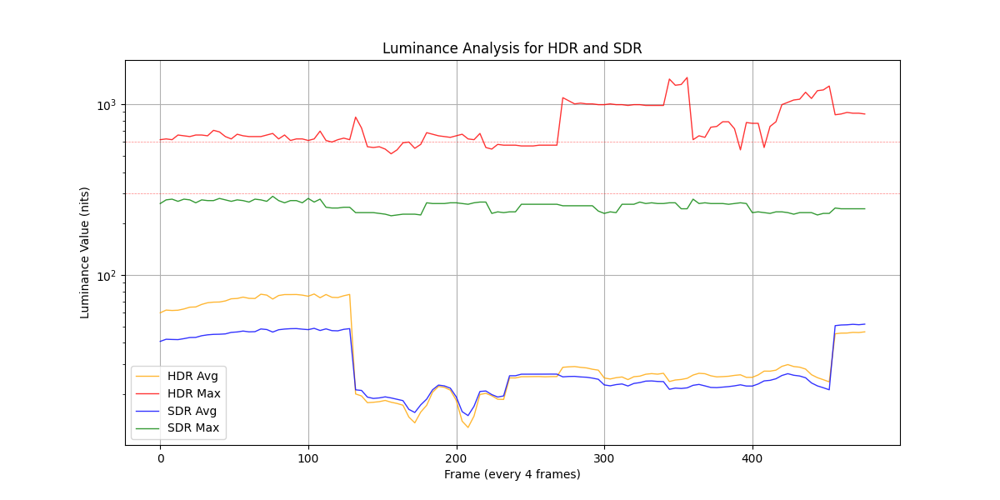

# lumi_analyzer
Plot avg/max brightness curves for SDR and HDR movies (using ffprobe statistics)  
Y vs nit look up table is from [this link](https://www.avsforum.com/threads/pq-to-nits-nits-to-pq-conversion.3274319/)

Results are plotted in the figure like this.  

If you already have an existing statistics file, you can also use the function in the code.  
